# Cryptocurrencies

## Overview

We are using unsupervised learning to process data, cluster data, reduce data dimensions, and reduce the principal components using PCA to create an analysis for your clients who are preparing to get into the cryptocurrency market.

This project consists of four technical analysis deliverables:
 - 1: Preprocessing the Data for PCA
 - 2: Reducing Data Dimensions Using PCA
 - 3: Clustering Cryptocurrencies Using K-means
 - 4: Visualizing Cryptocurrencies Results

## Resources
  - Data Source: crypto_data.csv
  - Software: anaconda3, python 3.7.7, jupyter notebook

## Results
### Preprocessing the Data for PCA
 - Starting Data
 
   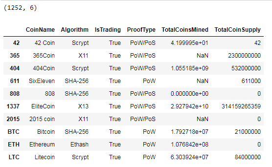

 - List with Algorithms
 
   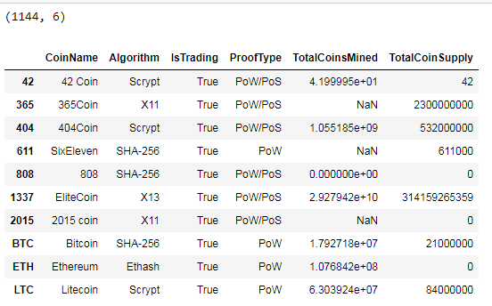
   
 - List with currently Traded
 
   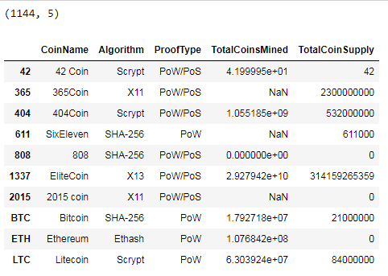
   
 - List with no null rows
 
   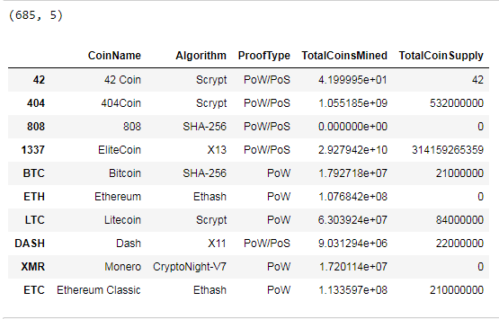
   
 - List with coins that are mined
 
   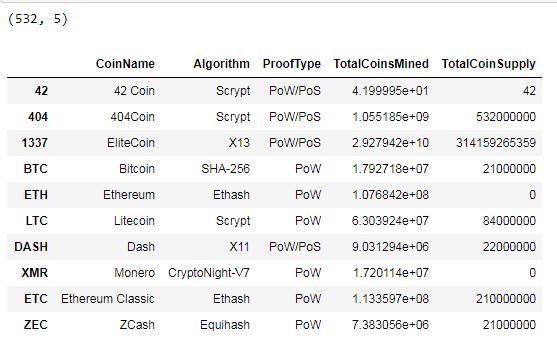
   
 - Dropping CoinName column
 
   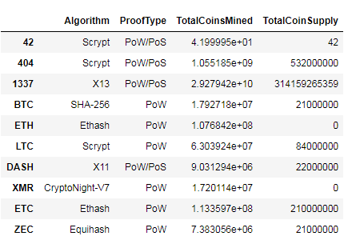
   
 - Converting all string data to numeric suing dummies function
 
   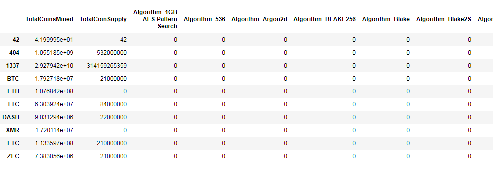
   

### Reducing Data Dimensions Using PCA
 - Reduction PCS table
 
   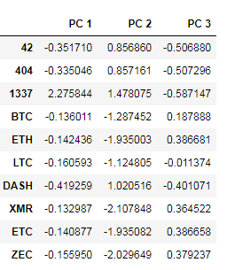
   
 - Elbow Curve
 
   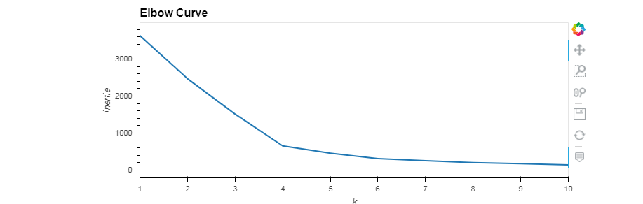
   

### Clustering Cryptocurrencies Using K-means
 - Clustering PCA table
 
   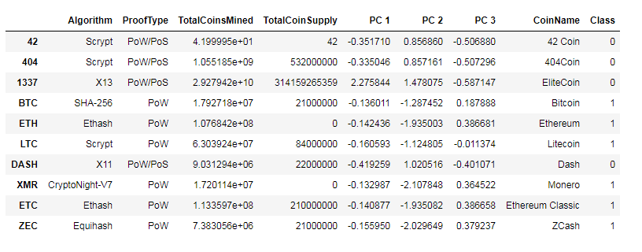
   
 - Coins Table
 
   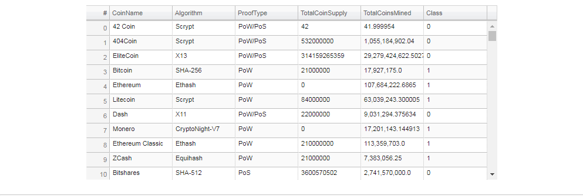
   
 - 3D Scatter plot
 
   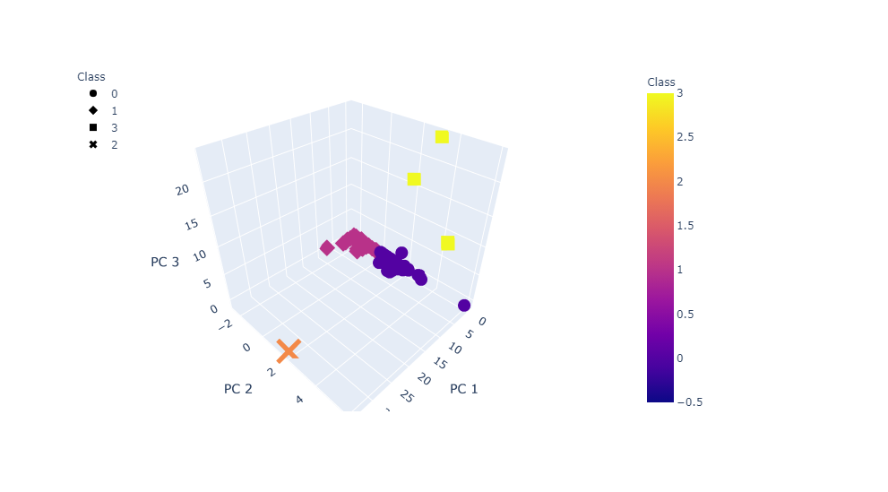
   

### Visualizing Cryptocurrencies Results
 - Coins mined vs supply table
 
   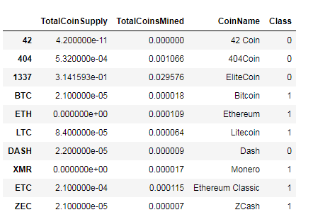
   
 - Coins mined vs supply scaled chart
 
   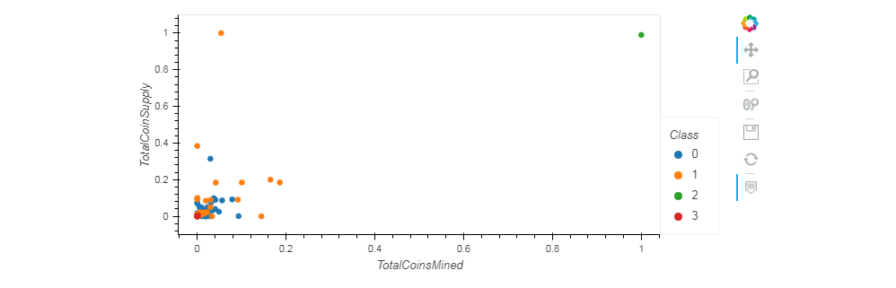
   

## Summary

